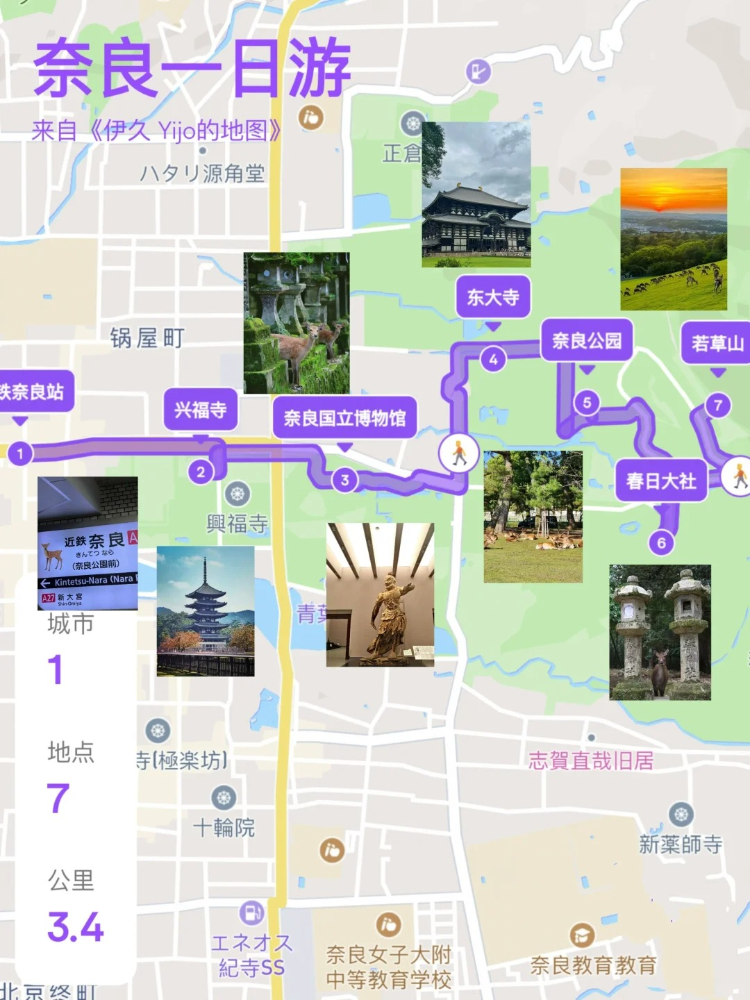

# 日本行 :japanese_goblin:

## 8.9~8.12

#### 8.9

飞机到日本羽田机场 **19:45**抵达

从机场去住宿放行李

> 乘坐东急机场线 急行 **京成成田** 第二站台 ID:KK16
>
> 无需换乘一直坐
>
> **浅草桥**下车步行
>
> 抵达CAFE/MINIMAL HOTEL OUR OUR办理入住

简单散步

去池袋汇合

> **浅草桥站**乘坐**中央、总武线各站停车各站停车中野（东京）** 第一站台 ID:JB20
>
>到**御茶水站**换乘**丸之内线各站停车池袋**
>
>到达池袋

#### 8.10

>富士山
>
>回转寿司
>
>神宫外苑花火
>

#### 8.11

> 去池袋
>
> 晴空树附近吃午餐
>
> 登上晴空树
>
> 晚上去新宿

### 8.12

1. 参观早稻田大学

2. 东京地下宫殿

3. 在观望东京塔的餐厅吃饭

### 住宿

- ___CAFE/MINIMAL HOTEL OUR OUR___

## 8.13~8.16

##### 8.13

##### 上午

从东京移动到**新大阪华盛顿广场酒店:hotel:**

放好行李, 去京都

- 京都东映太秦映画村eva基地

  

  > ✅Eva基地√🎫门票2400日元
  > 入场🆓，且还额外赠送一张工作人员为你和初号机拍的合影~
  > ✅巨大可乘坐初号机√
  > 有免费同步率测试，下楼处有二维码，扫码可看。站在手掌上还有官方摄像机为你拍带特效的照片！！价格不算便宜但是来一趟可以留下纪念所以推荐！！🎫1500日元一张，可以选择自行购买（16：30停止营业，想去的宝们尽量早点去）
  > ✅联动咖啡√
  > 🎫主食：1000日元，饮品：600日元，送随机杯垫。有限定场贩！不过可能会缺货，这个要看情况啦
  > ✅人物立牌√

- 闲逛

- 艺伎/歌伎

  > 🌺京都六大花街🌺
  > 1⃣️上七轩
  > 📍京都市上京区 Shinseichō, 742上七轩
  > 2⃣️祇園甲部
  > 📍京都市东山区 Gionmachi Minamigawa, 570-2 祇園甲部歌舞練場
  > 3⃣️祇園东
  > 📍京都市东山区 Kawabatachō, 祇園
  > 4⃣️嶋原
  > 📍京都市下京区 Kosakachō
  > 5⃣️先斗町
  > 📍京都市中京区 Nabeyachō, 211-3 先斗町
  > 6⃣️宫川町
  > 📍京都市东山区 Yamashirochō, 282-5 紡 祇園宮川町
  > 【嶋原以外的五个地方又合称五花街。 其中祇園甲部与祇園东都位于祇園，而大家所熟知的花见小路就是祇園甲部，是京都最大花街，同时也是电影《艺伎回忆录》拍摄的地点】

- 京都大学

##### 8.14

在大阪玩一天

>
>
>

##### 8.15

USJ

##### 8.16

###### 上午

- 从大阪移动到酒店

- 京都闲逛

###### 下午

- 京都贵船神社
- 搭==叡电==回到_BOOK HOTEL-京都九条_

### 住宿

- ***新大阪华盛顿广场酒店***

  > 8.13~8.16

- ***BOOK HOTEL-京都九条***

  >8.16~8.17

## 8.17

移动到奈良 7个地点 路程3.4公里

1. 📍近铁奈良站

>这里可以寄存行李，超大箱是1000日元/个，超大箱可以存放3个20寸行李箱

2. 📍兴福寺

>  营业时间：9:00-17:00
>  门票：600日元
>  日本的世界文化遗产之一，漫步在古老的寺庙间，感受历史的沉淀，兴福寺内还有许多值得一看的文物和宝藏

3. 📍奈良国立博物馆
> 营业时间：8:00-18:00
> 门票：700日元
> 是了解奈良历史文化的好去处，馆内藏品丰富，尤其以佛教艺术品最为出名

4. 📍奈良公园
> 营业时间：24h
> 门票：免费
> 这里有成群的小鹿，可以购买鹿饼（200日元/份）喂食小鹿、与它们亲密互动，带角的是公鹿，母鹿一般比较娇小干净

4. 📍东大寺
> 营业时间：8:30-17:30
> 门票：600日元
> 世界文化遗产，是日本佛教的三大寺院之一

5. 📍春日大社

> 营业时间：6:30-17:30
> 门票：500日元
> 供奉春日神的神社，也是奈良的象征之一

6. 📍若草山

> 营业时间：9:00-17:00
> 门票：150日元
> 若草山是观赏夕阳的最佳地点。登高远眺，整个奈良城尽收眼底。此时的小鹿也特别温顺，可以近距离互动

## 8.18

- 移动到广岛

- 原爆圆顶馆

- 海水泡鸟居

  

  >准备退潮的时候再去看一眼, 可以走到下面

- 广岛煎饼/生蚝

- BOOKOFF | 广岛大手町店 | 探店

  
  
  >✨1. 交通便利，广岛电铁本线「广岛站」转乘1号线（广岛站-纸屋町东）至「袋町站」即可到达
  >✨2. 动漫周边卖场是广岛县内最大的
  >✨3. 唱片・游戏等相关商品的备货也非常丰富
  >✨4. 经营商品有书籍・CD・唱片・DVD・蓝光光盘・游戏・新品游戏・交易卡牌・新品交易卡牌・爱好产品・一番赏・动漫周边・手机・智能手机・数码家电・生活家电・乐器・时装・和服・名牌商品・金・铂金・贵金属・餐具・杂货

## 8.19

- 九州

